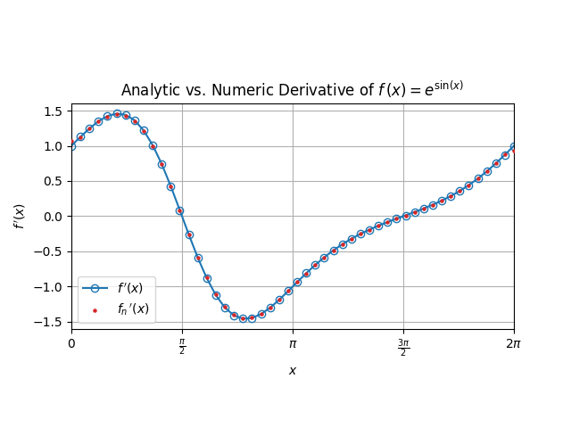
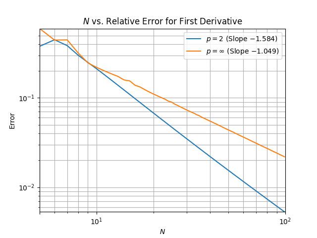
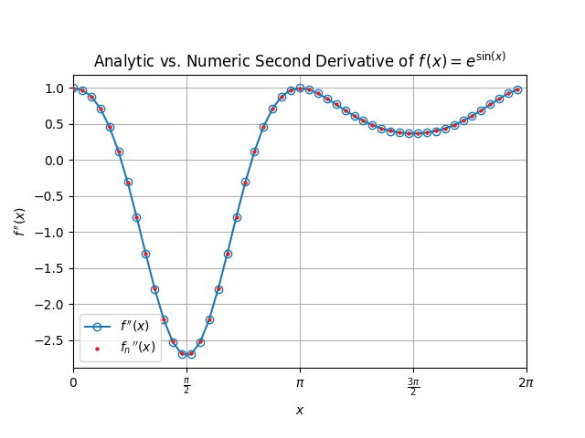
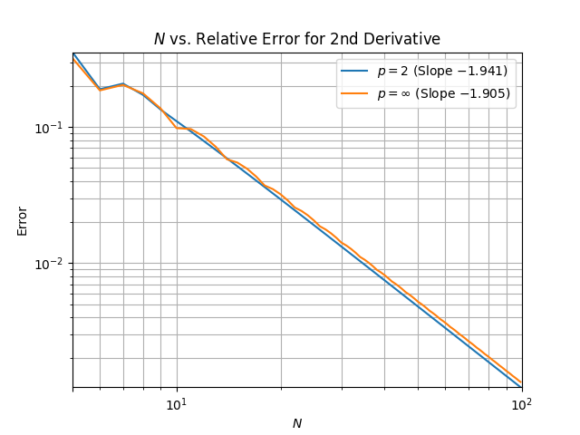
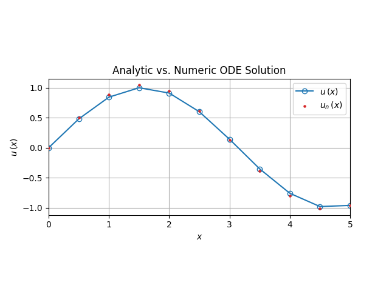
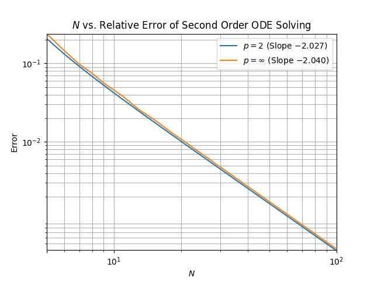
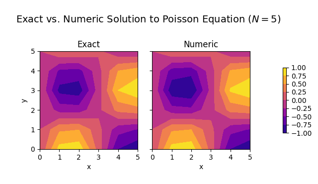
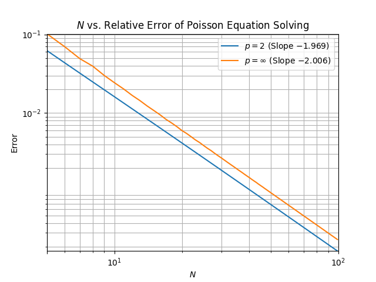

# Numerical PDEs Homework #0
Trin Wasinger | 20206-09-16

---
## Problem #1

  
   
  <b>Figure 1.1: Comparison of exact and numeric 2nd derivatives</b>

  
   
  <b>Figure 1.2: Error of derivative approximation</b>

## Problem #2

  
   
  <b>Figure 2.1: Comparison of exact and numeric 2nd derivatives</b>

  
   
  <b>Figure 2.2: Second order error of 2nd derivative approximation</b>

## Problem #3

  
   
  <b>Figure 3.1: Comparison of exact and numeric ODE solutions</b>

  
   
  <b>Figure 3.2: Second order error of ODE solution</b>

## Problem #4
### Part 1
> NOTE: My editor's AI autocomplete suggested a large portion of the boundary implementation (completly unprompted) as I started writing the first loop.
> It was more or less exactly what I was going to type anyways, but I am not sure how I feel about it. I've since found the setting to turn the AI autocomplete off.

  
   
  <b>Figure 4.1: Comparison of exact and numeric Poisson Equation solutions</b>

  
   
  <b>Figure 4.2: Second order error of numeric Poisson Equation solution</b>

### Part 2
